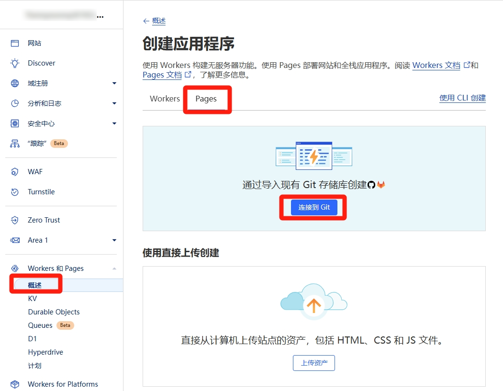
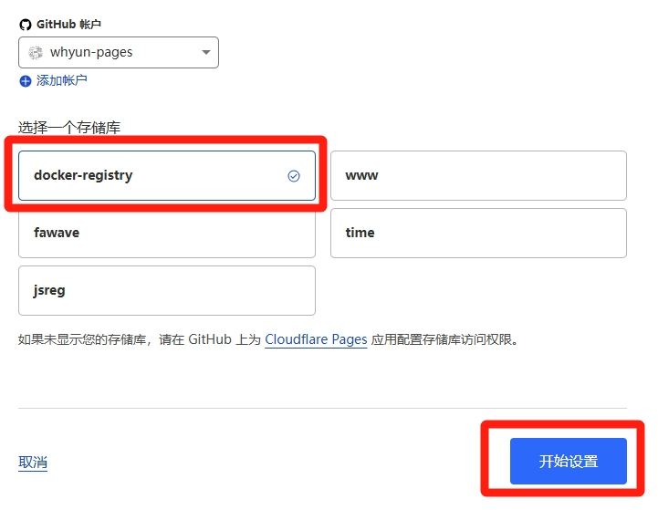
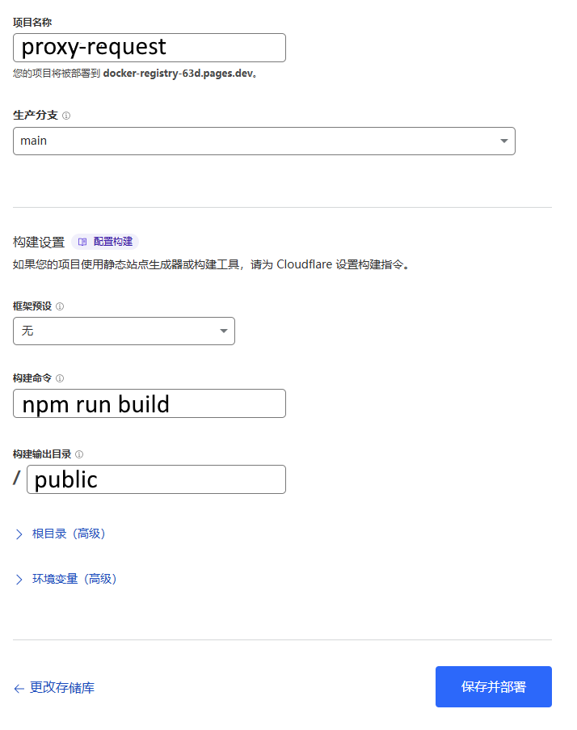
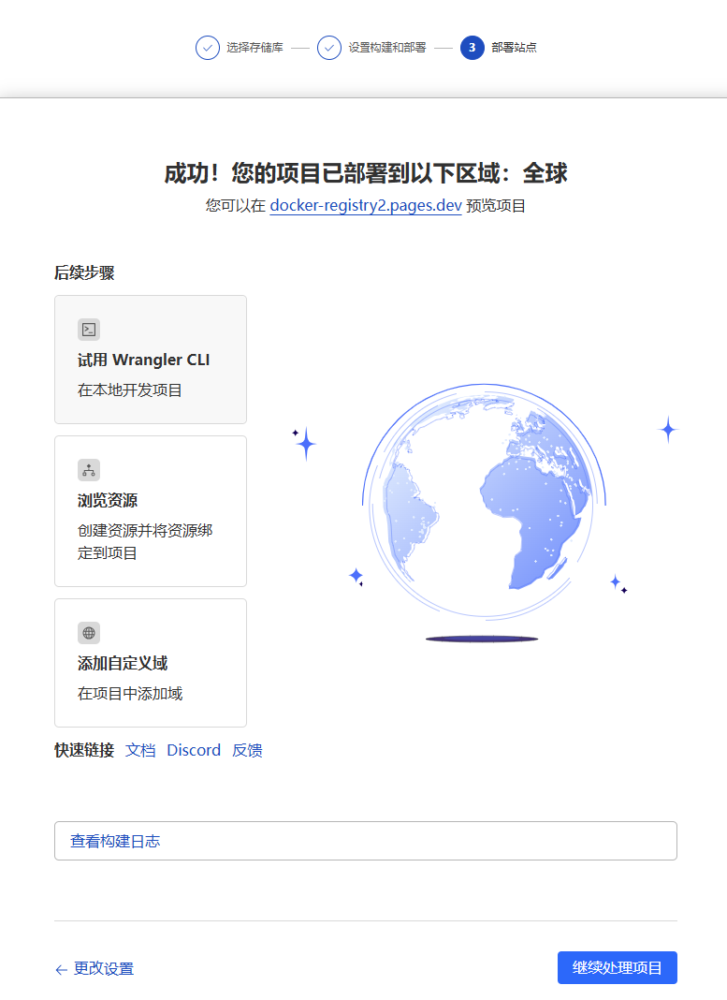
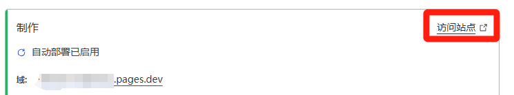
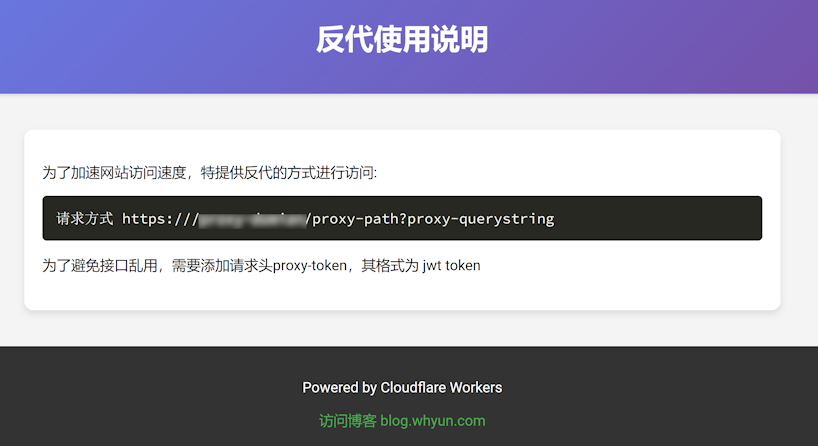
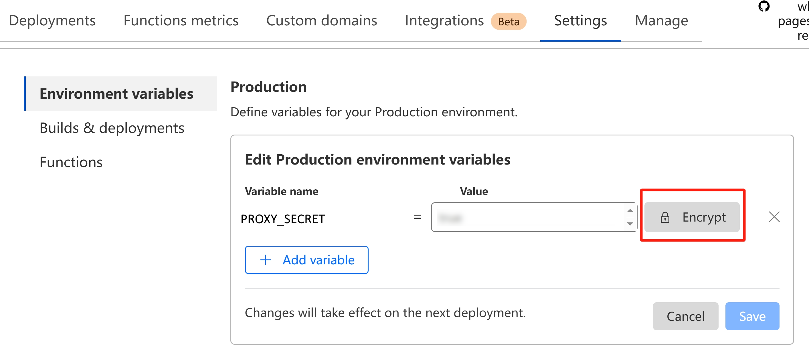

# docker-registry
使用 cloudflare pages 反向代理访问任意网址。

## 快速部署
请将本项目仓库 fork 到自己的 github 仓库，然后在 cloudflare pages 中新建项目来使用。
1.使用 cloudflare 账号登录其 dashboard 后台，选择 **Workers 和 Pages** 菜单，然后点击 **概述**，接着点击 **创建** 按钮，在打开的页面中选择 Pages 选项卡：

**图1.1**

选择 git 模式进行部署。

2.选择你 clone 好的项目，点击 **开始设置** 按钮：

**图1.2**

3.填写你的项目名，构建命令填写 `npm run build`，输出路径填写 `public`，点击 **保存并部署** 按钮：

**图1.3**

4.经过短暂时间的等待，如果你看到如下界面，恭喜你部署成功：

**图1.4**

5.点击 **继续处理项目按钮**，在展示的页面中点击 **访问站点** 链接，即可验证站点的部署情况，不过默认需要等几分钟才能打开网站。

**图1.5**

6.网站可访问后展示效果：

**图1.6**

更多详细使用教程参见 [cloudflare page 教程（一）项目初始化](https://blog.whyun.com/posts/project-init-on-cloudflare-pages/) 。

## 配置
可以通过配置若干环境变量，来对防止对于接口的滥用。

设置 `PROXY_SECRET` 环境变量后，请求必须携带头信息 `proxy-token` 才可以。

`PROXY_SECRET` 需要为 32 字节的16进制字符串，`proxy-token` 的值为以 `PROXY_SECRET` 为密钥签名出来的 jwt token 的 base64 字符串。

环境变量可以在 dashboard 面板中设置：

**图 2.1**